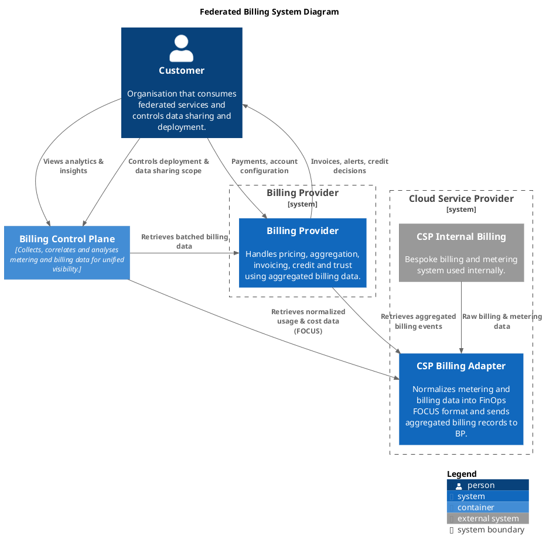

# Federated Billing Protocol

A protocol and set of schemas for the proposed federated cloud billing architecture. A Billing Provider (BP) aggregates usage and cost data from multiple Cloud Service Providers (CSPs) into unified, cryptographically verifiable invoices for a Customer.

## Architecture



- **Customer** – The consumer of cloud resources from one or more federated CSPs. Controls what data is shared and where components are deployed, and manages payments/account configuration with the Billing Provider.
- **Billing Control Plane** – Collects, correlates and analyses metering and billing data from CSPs and the Billing Provider, giving the customer unified visibility independent of any single provider.
- **Billing Provider (BP)** – Aggregates normalized billing data across CSPs and handles pricing, invoicing, credit limits and trust. See [`docs/hash_calculation.md`](docs/hash_calculation.md) for how invoice hashes are constructed and verified.
- **Cloud Service Provider (CSP)** – runs its own internal billing/metering system, exposed to the rest of the protocol through a **CSP Billing Adapter** that normalizes that data into the FinOps [FOCUS](https://focus.finops.org/) format and forwards aggregated billing records to the BP.

## Repository layout

- `schema/` – LinkML schemas for communication between the CSPs and BPs. Transport agnostic to enable use of preferred format (eg. REST, AMQP, etc.).
- `openapi/` – OpenAPI specifications which the BPs and CSPs must expose to enable the BCP to access and manage customer billing data.
- `docs/` – Protocol documentation
- `examples/` – sample records, e.g. `example_record.json`.

## Getting started

```bash
uv sync
```

Installs [LinkML](https://linkml.io/), used to validate and generate artifacts from the schemas in `schema/`.
