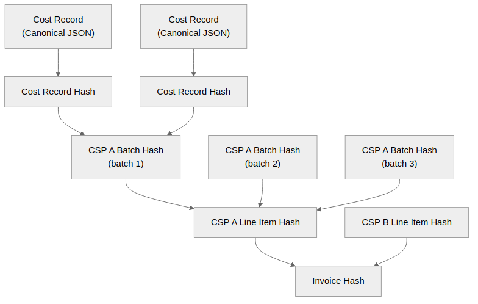

# Hash Construction Algorithm

For the purpose of integrity verification, the message schemas include hash fields at each level of the hierarchy: `record_hash`, `batch_hash`, `line_item_hash`, and `invoice_hash`. This document specifies how those hashes are computed, so that any two implementations that follow this specification will produce identical hash values.

The hashes construct an n-ary Merkle tree over the invoice data, with the leaves being the individual metering and cost records in FOCUS format. At each level, all child hashes are collected into a list, sorted alphabetically, put into a JSON structure with the level metadata, and hashed to produce the parent hash. The resulting hash is stored in the parent object, and the process repeats up to the invoice level.

The structure is as follows:



The tree structure ensures that a change to a record, batch, line item or invoice will invalidate the invoice hash.

## Canonicalization

All hash inputs in this document are JSON objects. Before hashing, every object MUST be serialized using JSON Canonicalization Scheme (JCS) RFC 8785. This ensures that the same json object always produces the same serialized output, regardless of white space, key ordering or other differences in input.

Implementations should use a conformant JCS library rather than implementing their own serialization. 

## Hash encoding

All hash values are computed using the SHA-256 algorithm, and the resulting hash is stored as a lowercase hexadecimal string.

## Ordering of child hashes

Wherever a hash input includes a list of child hashes (`record_hashes`, `batch_hashes`, `line_item_hashes`), that list must be sorted in ascending alphabetical order on the hash string. This ensures that the parent hash is not dependent on the ordering in which the child hashes were collected.

## Algorithm

### Level 0 — Record Hash

Computed by the CSP when a metering/cost record is received.

```
Input:  JSON object all fields FOCUS fields and the additional metadata required by the schema
Output: record_hash = SHA256( canonicalJSON(record) )
```

The full metering and cost record is hashed, including all fields in the FOCUS schema plus the additional metadata required as part of the federation billing architecture. The hash is computed over the canonical JSON serialization of the record object.

### Level 1 — Batch Hash

Computed by the CSP at batch creation time using the set of record hashes produces when the records was received. By combining 

```
Input:
    batch_id: string
    billing_account_id: string
    resource_provider_id: string
    billing_provider_id: string
    total_billed_cost: float
    billing_currency: string (ISO 4217)
    line_item_count: integer
    generated_at: string (ISO 8601)
    period_start: string (ISO 8601)
    period_end: string (ISO 8601)
    record_hashes[]: list of record_hash values, sorted alphabetically

Output: batch_hash = SHA256( canonicalJSON(batch_input) )
```

The record hashes and the batch data are combined into a JSON object which is then serialized into canonical JSON and hashed. The resulting hash represents the batch and all constituent records. Any change to a record in the batch will change the `batch_hash`, and any change to the batch metadata or totals will also change the `batch_hash`.

The batch hash is stored in the batch object by the CSP and sent along with the batch to the BP.

### 4.3 Level 2 — CSP Line Item Hash

The invoices produced by the BP are broken down into line items, one per CSP contributing to the invoice. Each line item contains the total cost for that CSP over the invoice period, along with the list of batch hashes received from that CSP. The line item hash is computed over the line item data and the list of batch hashes.

```
Input:
    csp_id: string
    invoice_period_start: string (ISO 8601)
    invoice_period_end: string (ISO 8601)
    total_billed_cost: float
    billing_currency: string (ISO 4217)
    batch_hashes[]: list of batch_hash values contributing to line item, sorted alphabetically

Output: line_item_hash = SHA256( canonicalJSON(line_item_input) )
```

### Level 3 — Invoice Hash

Computed by the BP as the final step, over all line item hashes for the
invoice.

```
Input:
  invoice_id: string
  billing_account_id: string
  total_billed_cost: integer
  billing_currency: string (ISO 4217)
  line_item_hashes[]: list of line_item_hash values, sorted alphabetically

Output: invoice_hash = SHA256( canonicalJSON(invoice_input) )
```

## Verification

To verify an invoice against source records, this process can be repeated to reconstruct the tree of hashes from the top down. The invoice hash is recomputed from the line item hashes, which are recomputed from the batch hashes, which are recomputed from the record hashes. If the recomputed invoice hash matches the recorded invoice hash, then the invoice is verified. As a secondary check, the total cost at each level can be recomputed and compared to the recorded total cost.

If a mismatch is found, then the issue can be localized to a specific batch or line item by re-running the hash computation at each level. This allows for efficient verification without requiring disclosure of all underlying data. 
